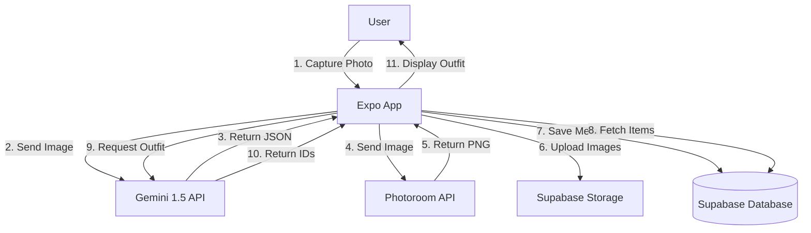
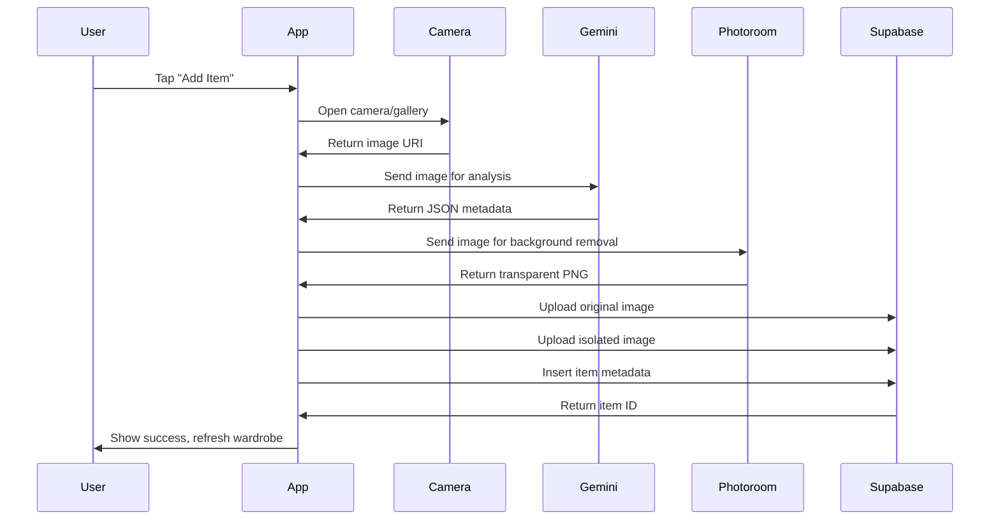
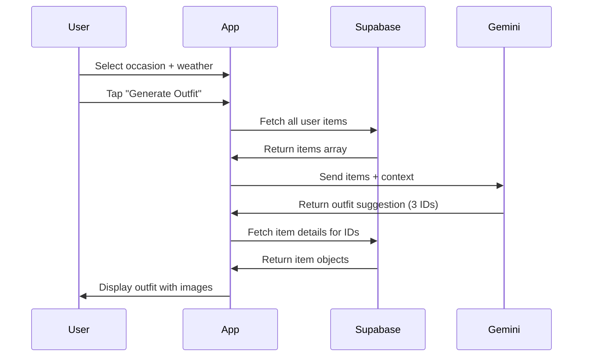

# OOTD AI - Technical Specification

## Architecture Overview



## Folder Structure

```
OOTD-AI/
├── app/                          # Expo Router app directory
│   ├── (tabs)/                  # Tab-based navigation
│   │   ├── index.tsx           # Home/Wardrobe screen
│   │   ├── upload.tsx          # Upload item screen
│   │   ├── ootd.tsx            # OOTD generator screen
│   │   └── _layout.tsx         # Tab layout
│   ├── _layout.tsx             # Root layout
│   └── +not-found.tsx          # 404 screen
├── components/                   # Reusable components
│   ├── ui/                     # Base UI components
│   │   ├── Button.tsx
│   │   ├── Card.tsx
│   │   └── ItemCard.tsx        # Wardrobe item card
│   └── WardrobeGrid.tsx        # Grid view component
├── services/                     # API service integrations
│   ├── supabase.ts             # Supabase client & helpers
│   ├── gemini.ts               # Gemini AI service
│   └── photoroom.ts            # Photoroom API service
├── types/                        # TypeScript definitions
│   ├── wardrobe.ts             # Wardrobe item types
│   └── database.ts             # Database schema types
├── lib/                          # Utility functions
│   └── validations.ts          # Zod schemas
├── hooks/                        # Custom React hooks
│   ├── useUploadItem.ts        # Upload item hook
│   └── useWardrobe.ts          # Fetch wardrobe hook
├── assets/                       # Static assets
│   ├── images/
│   └── fonts/
├── .env                          # Environment variables (gitignored)
├── .env.example                 # Environment template
├── app.json                     # Expo configuration
├── app.config.js                # Dynamic Expo config
├── tailwind.config.js           # Tailwind/NativeWind config
├── metro.config.js              # Metro bundler config
├── tsconfig.json                # TypeScript config
└── package.json                 # Dependencies
```

## Database Schema

### Supabase Tables

#### `items` Table

Stores individual wardrobe items with AI-generated metadata.

| Column | Type | Constraints | Description |
|--------|------|-------------|-------------|
| `id` | `uuid` | PRIMARY KEY, DEFAULT uuid_generate_v4() | Unique item identifier |
| `user_id` | `uuid` | FOREIGN KEY → auth.users(id), NOT NULL | Owner of the item |
| `image_url` | `text` | NOT NULL | URL to original photo in Storage |
| `isolated_image_url` | `text` | NOT NULL | URL to background-removed PNG |
| `category` | `text` | NOT NULL | Main category (e.g., "Top", "Bottom") |
| `subcategory` | `text` | NOT NULL | Specific type (e.g., "T-Shirt", "Jeans") |
| `color` | `text` | NOT NULL | Primary color |
| `material` | `text` | NOT NULL | Material/fabric type |
| `attributes` | `jsonb` | NOT NULL | Array of tags (e.g., ["casual", "summer"]) |
| `created_at` | `timestamptz` | DEFAULT now() | Creation timestamp |
| `updated_at` | `timestamptz` | DEFAULT now() | Last update timestamp |

**Indexes:**
- `idx_items_user_id` on `user_id`
- `idx_items_category` on `category`
- `idx_items_created_at` on `created_at` DESC

**Row Level Security (RLS):**
- Users can only SELECT/INSERT/UPDATE/DELETE their own items
- Policy: `user_id = auth.uid()`

#### `outfits` Table

Stores AI-generated outfit combinations.

| Column | Type | Constraints | Description |
|--------|------|-------------|-------------|
| `id` | `uuid` | PRIMARY KEY, DEFAULT uuid_generate_v4() | Unique outfit identifier |
| `user_id` | `uuid` | FOREIGN KEY → auth.users(id), NOT NULL | Owner of the outfit |
| `item_ids` | `uuid[]` | NOT NULL, CHECK (array_length(item_ids, 1) = 3) | Array of 3 item IDs |
| `occasion` | `text` | | Occasion context (e.g., "casual", "formal") |
| `weather` | `text` | | Weather context (e.g., "warm", "cold") |
| `gemini_suggestion` | `text` | | AI-generated explanation text |
| `created_at` | `timestamptz` | DEFAULT now() | Creation timestamp |

**Indexes:**
- `idx_outfits_user_id` on `user_id`
- `idx_outfits_created_at` on `created_at` DESC

**Row Level Security (RLS):**
- Users can only SELECT/INSERT their own outfits
- Policy: `user_id = auth.uid()`

### Storage Buckets

#### `wardrobe-images`
- **Public**: No (authenticated access only)
- **File size limit**: 10MB
- **Allowed MIME types**: `image/jpeg`, `image/png`, `image/heic`
- **Path structure**: `{user_id}/{item_id}/original.{ext}`

#### `isolated-images`
- **Public**: No (authenticated access only)
- **File size limit**: 5MB
- **Allowed MIME types**: `image/png`
- **Path structure**: `{user_id}/{item_id}/isolated.png`

### SQL Migration Scripts

```sql
-- Create items table
CREATE TABLE items (
  id UUID PRIMARY KEY DEFAULT uuid_generate_v4(),
  user_id UUID NOT NULL REFERENCES auth.users(id) ON DELETE CASCADE,
  image_url TEXT NOT NULL,
  isolated_image_url TEXT NOT NULL,
  category TEXT NOT NULL,
  subcategory TEXT NOT NULL,
  color TEXT NOT NULL,
  material TEXT NOT NULL,
  attributes JSONB NOT NULL DEFAULT '[]'::jsonb,
  created_at TIMESTAMPTZ DEFAULT NOW(),
  updated_at TIMESTAMPTZ DEFAULT NOW()
);

-- Create outfits table
CREATE TABLE outfits (
  id UUID PRIMARY KEY DEFAULT uuid_generate_v4(),
  user_id UUID NOT NULL REFERENCES auth.users(id) ON DELETE CASCADE,
  item_ids UUID[] NOT NULL CHECK (array_length(item_ids, 1) = 3),
  occasion TEXT,
  weather TEXT,
  gemini_suggestion TEXT,
  created_at TIMESTAMPTZ DEFAULT NOW()
);

-- Create indexes
CREATE INDEX idx_items_user_id ON items(user_id);
CREATE INDEX idx_items_category ON items(category);
CREATE INDEX idx_items_created_at ON items(created_at DESC);
CREATE INDEX idx_outfits_user_id ON outfits(user_id);
CREATE INDEX idx_outfits_created_at ON outfits(created_at DESC);

-- Enable RLS
ALTER TABLE items ENABLE ROW LEVEL SECURITY;
ALTER TABLE outfits ENABLE ROW LEVEL SECURITY;

-- RLS Policies for items
CREATE POLICY "Users can view own items"
  ON items FOR SELECT
  USING (auth.uid() = user_id);

CREATE POLICY "Users can insert own items"
  ON items FOR INSERT
  WITH CHECK (auth.uid() = user_id);

CREATE POLICY "Users can update own items"
  ON items FOR UPDATE
  USING (auth.uid() = user_id);

CREATE POLICY "Users can delete own items"
  ON items FOR DELETE
  USING (auth.uid() = user_id);

-- RLS Policies for outfits
CREATE POLICY "Users can view own outfits"
  ON outfits FOR SELECT
  USING (auth.uid() = user_id);

CREATE POLICY "Users can insert own outfits"
  ON outfits FOR INSERT
  WITH CHECK (auth.uid() = user_id);
```

## API Integrations

### Gemini 1.5 API

#### Service: `services/gemini.ts`

**Function: `processImageWithGemini(imageUri: string)`**

- **Input**: Local image URI (from camera/gallery)
- **Output**: Validated JSON object matching `WardrobeItemMetadata` schema
- **Model**: `gemini-1.5-pro` or `gemini-1.5-flash` (faster, cheaper)

**Prompt Structure:**
```
Analyze this clothing item image and return a JSON object with:
- category: Main category (Top, Bottom, Shoes, Accessories, Outerwear)
- subcategory: Specific type (e.g., "T-Shirt", "Jeans", "Sneakers")
- color: Primary color name
- material: Material/fabric type
- attributes: Array of descriptive tags (e.g., ["casual", "summer", "vintage"])

Return ONLY valid JSON, no markdown formatting.
```

**Expected Response Schema:**
```typescript
{
  category: string;
  subcategory: string;
  color: string;
  material: string;
  attributes: string[];
}
```

**Error Handling:**
- Network failures → Retry with exponential backoff
- Invalid JSON → Log error, return null
- API rate limits → Queue requests

#### Function: `generateOutfit(wardrobeItems: Item[], context: OutfitContext)`

- **Input**: Array of wardrobe items (with metadata), occasion + weather
- **Output**: Object with `itemIds: string[]` (3 IDs) and `suggestion: string`
- **Model**: `gemini-1.5-pro`

**Prompt Structure:**
```
Given this wardrobe:
{JSON array of items with id, category, subcategory, color, material, attributes}

Context:
- Occasion: {occasion}
- Weather: {weather}

Suggest 3 items that create a stylish, cohesive outfit. Return JSON:
{
  "itemIds": ["uuid1", "uuid2", "uuid3"],
  "suggestion": "Brief explanation of why these work together"
}
```

### Photoroom API

#### Service: `services/photoroom.ts`

**Function: `removeBackground(imageUri: string)`**

- **Input**: Local image URI
- **Output**: Local file path to transparent PNG
- **Endpoint**: `https://sdk.photoroom.com/v1/segment`
- **Method**: POST (multipart/form-data)

**Request:**
- `image_file`: Binary image data
- Headers: `x-api-key: {PHOTOROOM_API_KEY}`

**Response:**
- Binary PNG data (transparent background)
- Save to local filesystem using `expo-file-system`
- Return local URI for upload to Supabase

**Error Handling:**
- API failures → Return original image URI as fallback
- Network timeouts → Retry once

### Supabase Client

#### Service: `services/supabase.ts`

**Configuration:**
```typescript
import { createClient } from '@supabase/supabase-js';
import * as SecureStore from 'expo-secure-store';

const supabaseUrl = process.env.EXPO_PUBLIC_SUPABASE_URL!;
const supabaseAnonKey = process.env.EXPO_PUBLIC_SUPABASE_ANON_KEY!;

export const supabase = createClient(supabaseUrl, supabaseAnonKey, {
  auth: {
    storage: SecureStore,
    autoRefreshToken: true,
    persistSession: true,
  },
});
```

**Helper Functions:**
- `uploadImage(bucket: string, path: string, file: File)`
- `uploadIsolatedImage(userId: string, itemId: string, imageUri: string)`
- `createItem(itemData: InsertItem)`
- `getUserItems(userId: string)`
- `createOutfit(outfitData: InsertOutfit)`

## Data Flow

### Upload Flow



### OOTD Generation Flow



## Type Definitions

### `types/wardrobe.ts`

```typescript
export interface WardrobeItemMetadata {
  category: string;
  subcategory: string;
  color: string;
  material: string;
  attributes: string[];
}

export interface WardrobeItem {
  id: string;
  userId: string;
  imageUrl: string;
  isolatedImageUrl: string;
  category: string;
  subcategory: string;
  color: string;
  material: string;
  attributes: string[];
  createdAt: string;
  updatedAt: string;
}

export interface OutfitContext {
  occasion?: string;
  weather?: string;
}

export interface OutfitSuggestion {
  itemIds: string[];
  suggestion: string;
}

export interface Outfit {
  id: string;
  userId: string;
  itemIds: string[];
  occasion?: string;
  weather?: string;
  geminiSuggestion?: string;
  createdAt: string;
  items?: WardrobeItem[]; // Populated when fetching
}
```

### `types/database.ts`

```typescript
export interface Database {
  public: {
    Tables: {
      items: {
        Row: {
          id: string;
          user_id: string;
          image_url: string;
          isolated_image_url: string;
          category: string;
          subcategory: string;
          color: string;
          material: string;
          attributes: string[];
          created_at: string;
          updated_at: string;
        };
        Insert: {
          id?: string;
          user_id: string;
          image_url: string;
          isolated_image_url: string;
          category: string;
          subcategory: string;
          color: string;
          material: string;
          attributes: string[];
          created_at?: string;
          updated_at?: string;
        };
        Update: {
          id?: string;
          user_id?: string;
          image_url?: string;
          isolated_image_url?: string;
          category?: string;
          subcategory?: string;
          color?: string;
          material?: string;
          attributes?: string[];
          created_at?: string;
          updated_at?: string;
        };
      };
      outfits: {
        Row: {
          id: string;
          user_id: string;
          item_ids: string[];
          occasion: string | null;
          weather: string | null;
          gemini_suggestion: string | null;
          created_at: string;
        };
        Insert: {
          id?: string;
          user_id: string;
          item_ids: string[];
          occasion?: string | null;
          weather?: string | null;
          gemini_suggestion?: string | null;
          created_at?: string;
        };
        Update: {
          id?: string;
          user_id?: string;
          item_ids?: string[];
          occasion?: string | null;
          weather?: string | null;
          gemini_suggestion?: string | null;
          created_at?: string;
        };
      };
    };
  };
}
```

## Zod Schemas

### `lib/validations.ts`

```typescript
import { z } from 'zod';

export const WardrobeItemMetadataSchema = z.object({
  category: z.string().min(1),
  subcategory: z.string().min(1),
  color: z.string().min(1),
  material: z.string().min(1),
  attributes: z.array(z.string()).default([]),
});

export const OutfitSuggestionSchema = z.object({
  itemIds: z.array(z.string().uuid()).length(3),
  suggestion: z.string().min(1),
});
```

## Security Considerations

1. **API Keys**: Stored in `.env`, never committed to git
2. **Supabase RLS**: All database queries filtered by `user_id`
3. **Storage**: Private buckets with user-scoped paths
4. **Image Validation**: Validate file types and sizes before upload
5. **Rate Limiting**: Implement client-side rate limiting for API calls

## Performance Optimizations

1. **Image Compression**: Compress images before upload
2. **Lazy Loading**: Load wardrobe grid items on scroll
3. **Caching**: Cache Gemini responses for similar items
4. **Batch Operations**: Batch Supabase queries where possible
5. **Optimistic Updates**: Update UI immediately, sync in background

## Testing Strategy

1. **Unit Tests**: Test Zod schemas, utility functions
2. **Integration Tests**: Test API service functions
3. **E2E Tests**: Test complete upload and OOTD flows
4. **Manual Testing**: Test on physical devices (iOS + Android)

## Future Enhancements

- Outfit saving and favorites
- Seasonal wardrobe organization
- Style preferences learning
- Social sharing of outfits
- Integration with weather APIs
- Clothing care instructions
- Outfit calendar/history
